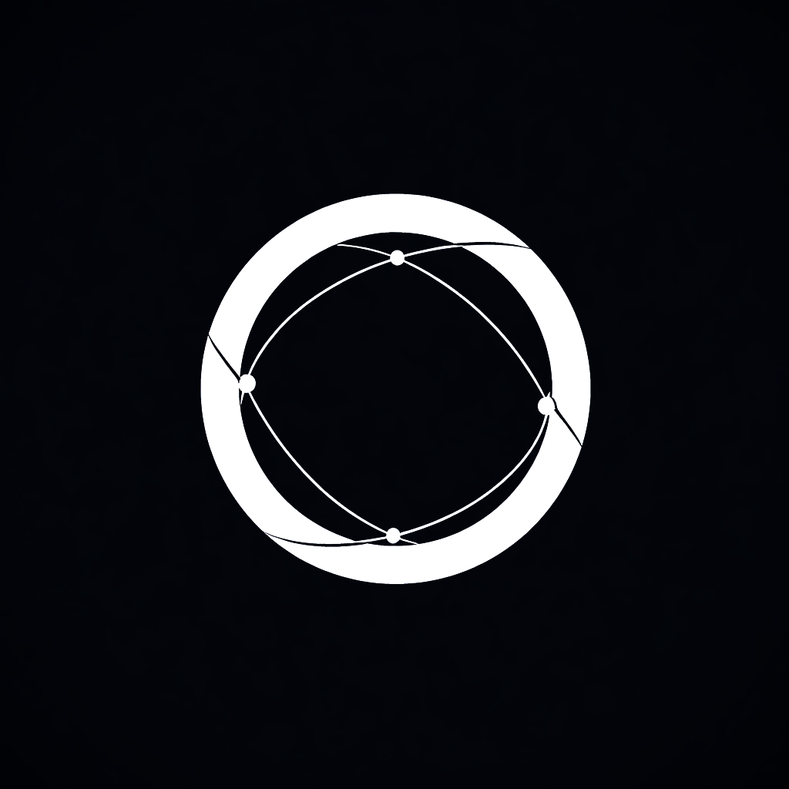

<p align="center">
  
</p>

<h1 align="center">ORION LAUNCHER</h1>

<p align="center">
  свой вход в наши миры
</p>

<p align="center">
  
  
  
</p>

---

Лаунчер для Minecraft. Свои сборки качает с сервера Orion. Из каталога ставит Modrinth, CurseForge и FTB.

Адрес сервера — в настройках.

## Запуск

Windows и [Node.js 20](https://nodejs.org/).

```bat
npm install
npm start
```

## Установщик

```bat
npm run build
```

Файл появится здесь: `dist/Orion Launcher Setup 1.8.10.exe`

## Репозиторий

```
src/main        Electron
src/renderer    интерфейс
assets          иконка, шрифты, скин-лоадер
```

Лицензия — [MIT](LICENSE).
